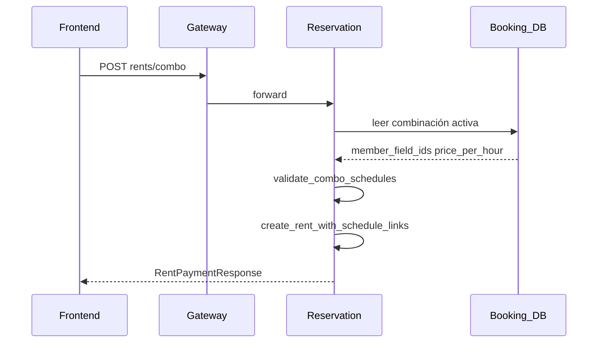

# Manual técnico — Funcionalidades avanzadas (PichangApp Backend)

**Versión orientada a documentación formal** (importación a Microsoft Word u otros editores). Complementa el [README principal](../README.md), que concentra la lista de endpoints y ejemplos HTTP.

| Campo | Contenido |
| --- | --- |
| **Objetivo** | Describir paso a paso cómo funcionan los flujos más complejos y para qué sirven, para equipos de frontend y de integración. |
| **Alcance** | Time slots por fecha, reservas en canchas combinadas (combo), visión de integración del chatbot Rasa. |
| **Audiencia** | Desarrolladores que consumen la API o replican reglas en cliente. |

---

## 1. Time slots por fecha

### 1.1. Propósito

El endpoint `GET /api/pichangapp/v1/reservation/schedules/time-slots` expone la grilla de **intervalos de una hora** en los que un jugador o admin puede ver disponibilidad “limpia” para una **cancha** (`field_id`) en un **día civil** concreto. Sirve para pantallas de reserva donde se elige fecha y luego un bloque horario, sin exponer la complejidad de todos los registros de `schedules` en bruto.

### 1.2. Flujo de extremo a extremo

1. El cliente envía `field_id` (obligatorio) y opcionalmente `date` (`YYYY-MM-DD`). Si omite `date`, el backend usa la fecha actual en la zona configurada del servicio.
2. El servicio de reservación carga un resumen de la cancha (horario de apertura/cierre, precio base, etc.).
3. Se invoca la función de dominio `build_time_slots_by_date` (archivo `services/reservation/app/domain/schedule/time_slots.py`), que construye la lista de slots candidatos y marca cuáles están ocupados.

### 1.3. Paso a paso interno (lógica de negocio)

**Paso A — Zona horaria.** Se resuelve `ZoneInfo` desde la configuración del servicio (`TIMEZONE`). Si el identificador no es válido, se usa UTC. Todas las combinaciones fecha+hora de apertura/cierre de la cancha se anclan a esa zona y, para cálculos internos, parte de los instantes se normaliza a “hora local naive” para comparar de forma consistente con los horarios almacenados.

**Paso B — Segmentos del día.** Si `close_time` es posterior a `open_time` en el mismo día civil, el intervalo operativo es un solo segmento `[open, close)`. Si el negocio cruza medianoche (`close_time <= open_time` en el sentido de reloj del mismo día), el día se parte en dos segmentos: de inicio del día civil hasta `close_time`, y de `open_time` hasta fin del día civil. Esto permite turnos nocturnos sin perder tramos válidos.

**Paso C — Horarios existentes y rentas.** Se cargan los `schedules` de la cancha para la fecha objetivo. Se determina qué `schedule_id` tienen **rentas activas** (excluyendo estados finales como cancelado, según constantes del servicio). Con ello se construye una lista de **rangos ocupados** en el tiempo: bloquean el slot si el estado del schedule es “bloqueante”, si no es un estado disponible/expirado de un conjunto conocido, o si hay renta activa ligada a ese schedule.

**Paso D — Generación de slots de una hora.** Sobre cada segmento abierto, se avanza en pasos de una hora, alineando el inicio al siguiente múltiplo de una hora desde un ancla (`open_time` del día). Para el **día actual**, el inicio efectivo no puede ser anterior a “ahora” (evita ofrecer slots ya pasados).

**Paso E — Precio por intervalo.** Si un tramo coincide exactamente con un schedule existente que aporta precio, se usa ese precio; si no, se usa `price_per_hour` de la cancha.

**Paso F — Marcar ocupación por índice de slot.** Los rangos ocupados se proyectan sobre los índices de slots de una hora respecto del ancla del día. Así se marca un conjunto de índices ocupados y el resultado final filtra los slots generados (`O(n)` sobre slots + ocupación), en lugar de comprobar solapamiento de cada slot contra cada rango con una doble iteración ingenua.

### 1.4. Qué debe hacer el frontend

- Consumir la lista `{ start_time, end_time, status, price }` tal como la serializa FastAPI (instantes con offset o `Z` según datos).
- No recalcular disponibilidad cruzando rentas manualmente: la fuente de verdad es este endpoint (o `.../schedules/available` si el flujo es por día de semana sin vista calendario por fecha).
- Tener en cuenta **duración fija de 1 hora** en esta vista; si el producto permite duraciones distintas, deben definirse otras reglas o endpoints en el futuro.

### 1.5. Archivos clave

| Archivo | Rol |
| --- | --- |
| `services/reservation/app/api/v1/schedule_routes.py` | Expone `time-slots`. |
| `services/reservation/app/services/schedule_service.py` | Orquesta lectura de cancha y slots. |
| `services/reservation/app/domain/schedule/time_slots.py` | Algoritmo de generación y ocupación. |

---

## 2. Canchas combinadas y reserva combo

### 2.1. Propósito

Algunos campus venden **dos o más canchas físicas como una unidad lógica** (por ejemplo, unir dos canchas 7 para un partido 11). En booking se define una **combinación** (`field_combination`) con miembros ordenados. En reservación, una **renta combo** referencia **un único pago** y **varios horarios** (uno por cancha miembro), todos con la misma ventana de tiempo.

### 2.2. Modelo de datos (booking)

1. **Combinación** (`id_combination`, `id_campus`, nombre, estado, `price_per_hour`).
2. **Miembros** (`members`): lista de `{ id_field, sort_order }`, mínimo dos canchas. El orden puede importar para presentación o reglas de negocio.
3. Los endpoints CRUD están bajo `/api/pichangapp/v1/booking/.../field-combinations` (ver README).

### 2.3. Flujo de reserva combo (reservation)

**Paso 1 — Solicitud del cliente.** `POST /api/pichangapp/v1/reservation/rents/combo` con:

- `id_combination`: la combinación activa en booking.
- `id_schedules`: lista de ids de horarios, **uno por cada cancha** de la combinación.
- `status`: debe ser `pending_payment` (el servicio rechaza otros valores en creación combo).
- Opcionales: datos de cliente, `id_payment`, etc., según el mismo esquema que una renta simple.

**Paso 2 — Validación de la combinación.** El servicio de reservación consulta a booking (vista SQL / lector) para obtener la combinación **activa** y la lista de `member_field_ids`. Si no existe o está inactiva → `404`.

**Paso 3 — Validación cruzada de horarios (`validate_combo_schedules`).**

- No se permiten `schedule_id` duplicados.
- La cantidad de ids debe coincidir con la cantidad de canchas en la combinación.
- Cada schedule debe pertenecer a una cancha distinta y, en conjunto, deben cubrir **exactamente** el set de canchas de la combinación.
- Todos los schedules deben compartir la **misma** ventana `start_time`/`end_time` y el **mismo** `day_of_week` (reglas de alineación temporal).
- Ninguno debe tener renta activa en estados no excluidos (típicamente conflictos → `409`).

**Paso 4 — Cálculo de monto.** El precio por hora de la combinación (`combo.price_per_hour`) sustituye al precio por hora individual para el cálculo del monto (`compute_combo_mount`), usando la duración efectiva del horario primario.

**Paso 5 — Persistencia y efectos en horarios.** Se crea **una** renta enlazada a **varios** schedules (tabla de vínculos interna). Los horarios involucrados pasan a estado de **espera de pago** (hold), y se refresca el estado agregado de cada cancha. Pueden programarse tareas en segundo plano para revertir estados tras el fin del evento.

**Paso 6 — Respuesta al cliente.** Igual que la renta simple exitosa en modo pago pendiente: objeto `rent` (con `schedules` múltiples y `schedule` primario) más `payment_instructions` (código, mensaje, datos Yape/Plin si aplican).

### 2.4. Qué debe hacer el frontend

1. Obtener combinaciones del campus o por cancha (`GET .../field-combinations`).
2. Para la fecha elegida, obtener **time slots** o schedules disponibles **por cada** `id_field` miembro y seleccionar bloques que coincidan en hora (mismo inicio/fin).
3. Enviar los `id_schedules` en un orden coherente con los miembros (el backend reordena internamente según `member_field_ids`, pero los ids deben ser los correctos por cancha).
4. Tras `201`, guiar al flujo de pago usando `payment_instructions`.

### 2.5. Diagrama de secuencia (simplificado)

### 2.6. Archivos clave

| Archivo | Rol |
| --- | --- |
| `services/booking/app/api/v1/field_combination_routes.py` | CRUD combinaciones. |
| `services/reservation/app/domain/rent/combo.py` | Validación y monto combo. |
| `services/reservation/app/services/rent_service.py` | `create_rent_combo`. |
| `services/reservation/app/integrations/booking_reader.py` | Lectura de combinación para reservación. |

---

## 3. Integración Rasa (vista para frontend y backend)

### 3.1. Propósito

El microservicio HTTP de Rasa no entrena el modelo: **autentica**, **enriquece metadata** y **puentea** hacia el servidor Rasa (REST). Así el frontend solo habla HTTPS con el mismo esquema de JWT que el resto de la plataforma.

### 3.2. Paso a paso de una interacción

1. El cliente llama `POST /api/pichangapp/v1/chatbot/messages` con Bearer token.
2. El servicio extrae `user_id` de los claims (`sub` o `id`) y normaliza el **rol** (`admin` vs `player`) a partir de claims y/o base de datos.
3. Se determina `conversation_id` (explícito en body o `user-{id}` por defecto).
4. Se fusiona `metadata`: datos del usuario, rol, token en bruto para acciones Rasa que deben llamar de vuelta a APIs internas, y `model` por defecto.
5. Se comprueba disponibilidad del servidor Rasa; si está listo, se reenvía el mensaje.
6. La respuesta es una lista de mensajes en formato compatible con Rasa (`text`, `image`, `custom`).

### 3.3. Historial

`GET .../chatbot/users/{user_id}/history` lee sesiones y logs persistidos (tablas bajo esquema `analytics` gestionadas desde acciones Rasa). Solo el propio usuario o un **admin** puede ver el historial de un `user_id` dado.

### 3.4. Para qué sirve la separación

- **Seguridad:** evita que el frontend hable directo con Rasa sin control de identidad.
- **Observabilidad:** sesiones e intents quedan trazados en base (detalle en documentación del servicio Rasa).
- **Evolución del modelo:** entrenamiento, stories y acciones siguen en el proyecto Rasa, no en este documento.

### 3.5. Documentación operativa de Rasa

Instalación, Docker, variables de entorno, `action_session_start`, políticas JWT para acciones admin y estructura de acciones personalizadas: **[services/rasa/README.md](../services/rasa/README.md)**.  
Estructura modular de helpers de acciones: **[services/rasa/actions/domain/chatbot/README.md](../services/rasa/actions/domain/chatbot/README.md)**.

---

## 4. Tabla resumen de archivos de dominio (referencia rápida)

Tras la consolidación de README en la raíz del repo, la siguiente tabla sustituye la orientación que antes estaba repartida en `services/*/app/domain/README.md`.

| Microservicio | Directorio dominio | Contenido típico |
| --- | --- | --- |
| Auth | `services/auth/app/domain/` | Hash de contraseñas, JWT, sesiones, Google OAuth, auditoría. |
| Booking | `services/booking/app/domain/` | Validaciones de negocio, campus, canchas, imágenes, disponibilidad. |
| Reservation | `services/reservation/app/domain/` | Rentas, validación de schedules, time slots, pagos/notificaciones asociados a rent. |
| Payment | `services/payment/app/domain/` | Reglas de pagos y métodos de pago. |

---

## 5. Glosario breve

| Término | Significado |
| --- | --- |
| **Schedule** | Bloque de tiempo asociado a una cancha (estado, precio, usuario opcional). |
| **Rent** | Reserva confirmada o en flujo de pago, ligada a uno o más schedules. |
| **Combo** | Renta que bloquea simultáneamente varias canchas de una combinación lógica. |
| **Time slot** | Intervalo de presentación (aquí 1 h) derivado de políticas de apertura y ocupación. |
| **Metadata Rasa** | Diccionario enviado al motor NLU/dialogo con contexto de usuario y token. |
