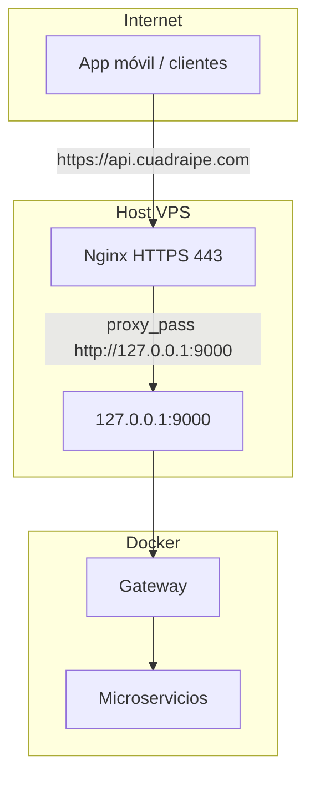

# Manual: API pública, red, puertos y firewall (producción)

Este documento describe la arquitectura HTTPS del API Gateway, los puertos que expone Docker en la VM, cómo encaja Nginx y UFW, y qué variables de entorno deben apuntar al dominio público.

**Frase clave:** todo el tráfico de clientes entra por HTTPS → Nginx en el host → `127.0.0.1:9000` → contenedor gateway → red Docker → microservicios por nombre (`auth:8000`, etc.).

---

## Objetivos

- Usar dominio con HTTPS (`https://api.cuadraipe.com`).
- No exponer el gateway por IP pública en el puerto 9000.
- Mantener microservicios hablando entre sí por la red interna de Docker.
- Permitir que la app móvil use solo HTTPS (evita bloqueos y “network error” por cleartext).

---

## Flujo general

### Antes (problema típico)

La app llamaba directamente a `http://<IP>:9000`:

- HTTP en producción: Android puede bloquear cleartext.
- IP sin dominio: menos flexible para certificados y branding.
- Puerto 9000 del gateway publicado en `0.0.0.0:9000`: accesible desde Internet sin pasar por Nginx/SSL.

### Ahora (solución)



1. **DNS** (ej. Hostinger): `api.cuadraipe.com` → IP pública del VPS (ej. `31.97.95.61`).
2. **Nginx** en el host: termina TLS (certificado Let’s Encrypt / Certbot) y hace `proxy_pass` a `http://127.0.0.1:9000`.
3. **Docker**: el servicio `gateway` publica **`127.0.0.1:9000:9000`**, no `0.0.0.0:9000`. Solo procesos en el mismo host (Nginx) pueden conectar a ese puerto en la interfaz loopback.
4. **Red interna**: el gateway enruta a `http://auth:8000`, `http://reservation:8002`, etc. Eso **no** usa HTTPS entre contenedores; no hace falta para el tráfico interno.

---

## Capas de seguridad (resumen)

| Capa | Rol |
|------|-----|
| DNS | Apunta el subdominio al VPS. |
| Nginx | Reverse proxy + HTTPS en 443. |
| Certbot / ACME | Renovación del certificado TLS. |
| Docker (gateway) | `127.0.0.1:9000:9000` para que 9000 no sea accesible desde la IP pública del host. |
| UFW (opcional recomendado) | Bloquear 9000/tcp desde fuera como refuerzo; permitir 22, 443, 80 según política. |

---

## Puertos publicados por `docker-compose` (referencia)

En el `docker-compose.yml` del repositorio, los servicios publican en el **host** lo siguiente (salvo que lo cambies en tu fork):

| Puerto host | Servicio | Uso |
|-------------|----------|-----|
| **9000** | `gateway` | API HTTP del gateway. En producción debe quedar solo en **`127.0.0.1:9000`** para Nginx. |
| **8000** | `auth` | Auth (útil en dev; en producción suele no exponerse si solo entra por gateway). |
| **8001** | `booking` | Booking. |
| **8002** | `reservation` | Reservation. |
| **8003** | `payment` | Payment. |
| **8004** | `notification` | Notification. |
| **8005** | `analytics` | Analytics. |
| **8006** | `rasa` | Rasa API. |
| **5055** | `rasa` | Action server de Rasa (acciones custom). En producción suele no exponerse al público; el compose incluye una nota para quitar el mapeo si no depuras desde el host. |
| **5432** | `postgres` | PostgreSQL. **Riesgo si queda en `0.0.0.0:5432` en Internet.** Ver sección siguiente. |
| **8080** | `kafka-ui` | **Interfaz web Kafka UI** (Provectus), no es “Kafka broker” en sí; el broker usa 9092 dentro de la red. |
| **9092** | `kafka` | Broker Kafka (PLAINTEXT) expuesto al host. |
| **29092** | `kafka` | Listener “host” para clientes externos al contenedor (según `KAFKA_PUBLIC_HOST`). |
| **2181** | `zookeeper` | Zookeeper para la stack Confluent local. |

**Nota:** 8080 es **Kafka UI** (consola web), no el puerto del broker. El broker Kafka escucha en **9092** (y **29092** para acceso desde fuera del contenedor según configuración).

---

## Puertos del sistema (host), no Docker

| Puerto | Servicio típico | Comentario |
|--------|------------------|------------|
| **22** | SSH | Casi siempre expuesto para administración. Restringe por clave fuerte, `AllowUsers`, y/o VPN / bastion. |
| **80** | HTTP | A menudo solo para redirección a HTTPS. |
| **443** | HTTPS | Entrada pública de la API vía Nginx. |

Estos los gestiona el SO y Nginx, no el `docker-compose` del gateway.

---

## PostgreSQL (5432) y “solo para mí”

Hoy el compose suele tener `ports: - "5432:5432"`, lo que enlaza **todas las interfaces** del host (`0.0.0.0`). Eso **sí** es alcanzable desde Internet si el firewall no lo bloquea.

Para que solo tú (o el propio host) accedan:

1. **Enlace solo a localhost** (recomendado si necesitas `psql` desde el VPS):

   ```yaml
   ports:
     - "127.0.0.1:5432:5432"
   ```

2. **UFW**: denegar 5432 desde fuera y permitir solo tu IP si alguna vez debe ser remoto:

   ```bash
   sudo ufw deny 5432/tcp
   # o reglas más finas con allow from TU_IP
   ```

3. **Nunca** expongas 5432 sin contraseña fuerte y, si es posible, certificado cliente o túnel SSH.

---

## Firewall (UFW) sugerido

Ejemplo de política (ajústala a tu IP y necesidades):

```bash
sudo ufw default deny incoming
sudo ufw default allow outgoing
sudo ufw allow 22/tcp
sudo ufw allow 80/tcp
sudo ufw allow 443/tcp
# Refuerzo: aunque Docker ya no publique 9000 en 0.0.0.0, puedes denegar 9000 desde fuera
sudo ufw deny 9000/tcp
sudo ufw enable
sudo ufw status verbose
```

- **Nginx → gateway**: sigue funcionando porque la conexión es a `127.0.0.1:9000` en el mismo host, no desde Internet directo al puerto publicado en la IP pública (con `127.0.0.1:9000:9000`).

---

## Comunicación interna (no cambia)

```text
gateway  → http://auth:8000
gateway  → http://booking:8001
gateway  → http://reservation:8002
gateway  → http://payment:8003
gateway  → http://notification:8004
gateway  → http://analytics:8005
gateway  → http://rasa:8006
```

- Misma red Docker (`pichangapp-network`).
- Nombres de servicio como hostname.
- **No** hace falta HTTPS entre contenedores para este diseño.

---

## Variables y URLs públicas

Evita enlaces en correos, deep links o apps que sigan usando `http://31.97.95.61:9000`.

| Concepto | Valor recomendado |
|----------|-------------------|
| Base pública API | `https://api.cuadraipe.com` |
| Ejemplo app / Expo | `EXPO_PUBLIC_API_URL=https://api.cuadraipe.com` |
| Fallback pase reserva (notification) | `RESERVATION_PASS_FALLBACK_BASE_URL=https://api.cuadraipe.com/api/pichangapp/v1/notification/notifications/reservation-pass` |
| Genérico en compose | `PUBLIC_API_BASE_URL` (por defecto en compose apuntando al mismo dominio) |

Ruta típica de API detrás del gateway:

```text
https://api.cuadraipe.com/api/pichangapp/v1/...
```

Nginx debe reenviar el path completo al upstream `http://127.0.0.1:9000` (incluyendo `/api/pichangapp/...`).

---

## Impacto en la app móvil

| Antes | Ahora |
|-------|--------|
| `baseURL: "http://31.97.95.61:9000"` | `baseURL: "https://api.cuadraipe.com"` |

- Cleartext desaparece en la URL pública.
- El certificado válido satisface a Android/iOS en builds de release.

---

## Checklist después de desplegar

1. DNS de `api.cuadraipe.com` resuelve a la IP del VPS.
2. `curl -I https://api.cuadraipe.com` devuelve 200/301 y certificado válido.
3. En el VPS: `curl -sS http://127.0.0.1:9000/...` llega al gateway.
4. Desde fuera: `http://IP_PUBLICA:9000` **no** debe conectar (con `127.0.0.1:9000:9000` + opcional UFW).
5. Variables `.env` / compose con `https://api.cuadraipe.com` para enlaces públicos.
6. Revisar si en producción quieres **dejar de publicar** `8000`–`8006`, `8080`, `9092`, etc., en `0.0.0.0` y usar solo gateway + SSH tunnel o VPN para operaciones.

---

## Resumen técnico rápido

| Componente | Rol |
|--------------|-----|
| DNS | Dominio → IP del VPS |
| Nginx | Proxy reverso + TLS en 443 |
| Certbot | Renovación SSL |
| Gateway | Orquesta rutas a microservicios |
| Docker network | Comunicación interna por nombre de servicio |
| Bind `127.0.0.1:9000` + UFW | Reduce superficie del puerto 9000 |

---

## Documentos relacionados

- [manual-document.md](manual-document.md) — documentación funcional general.
- [manual-funcionalidades-avanzadas.md](manual-funcionalidades-avanzadas.md) — funcionalidades avanzadas.

Si más adelante mueves Nginx dentro de Docker o usas otro reverse proxy (Traefik, Caddy), este manual sigue siendo válido en espíritu: **TLS en el borde**, **gateway solo en loopback o red interna**, **microservicios sin exposición innecesaria**.
